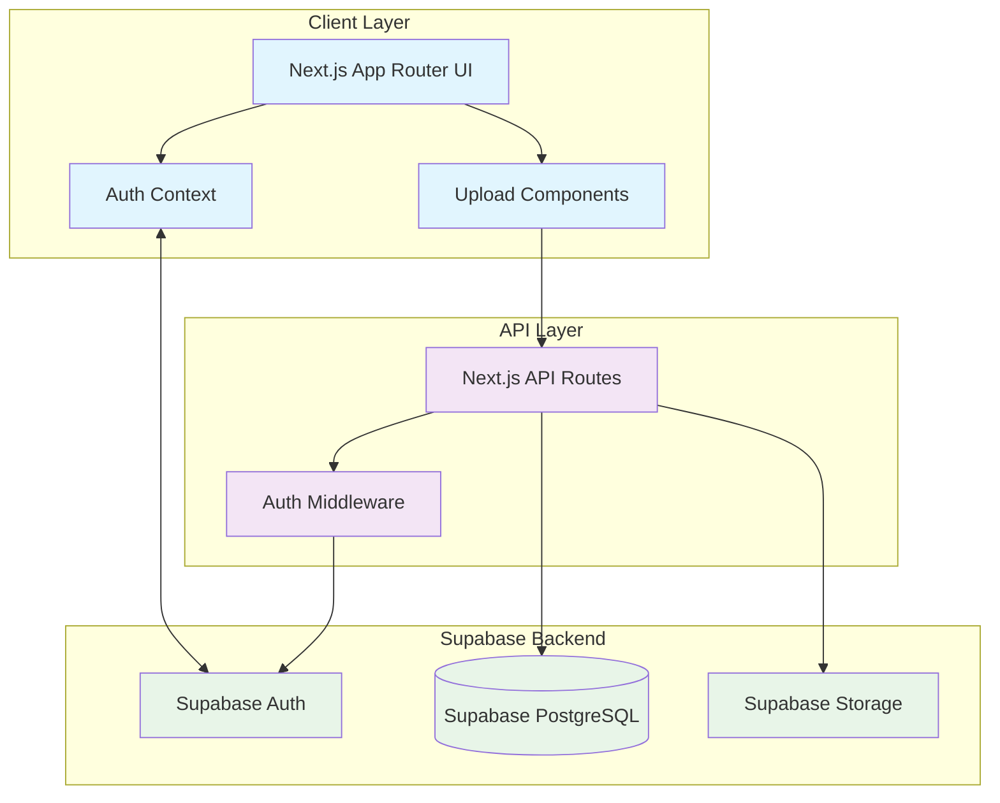

# Design Document

## Overview

The Public Art Upload System transforms the existing art gallery into a community-driven platform using Supabase as the complete backend solution. The system integrates Supabase Authentication for user management, PostgreSQL database for metadata storage, and Supabase Storage for permanent image hosting. The architecture follows Next.js 14 App Router patterns with server-side rendering for optimal performance and SEO.

## Architecture

### System Architecture Diagram



### Technology Stack Integration

- **Frontend**: Next.js 14 App Router with TypeScript
- **Authentication**: Supabase Auth with @supabase/ssr
- **Database**: Supabase PostgreSQL with auto-generated APIs
- **Storage**: Supabase Storage for image files
- **State Management**: React Context + Supabase real-time subscriptions
- **Styling**: Existing Tailwind CSS with glassmorphic design system

## Components and Interfaces

### 1. Supabase Client Configuration

```typescript
// lib/supabase/client.ts
interface SupabaseConfig {
  url: string
  anonKey: string
}

interface SupabaseClient {
  auth: AuthClient
  storage: StorageClient
  from: (table: string) => QueryBuilder
}
```

### 2. Authentication System

```typescript
// contexts/supabase-auth-context.tsx
interface AuthUser {
  id: string
  email: string
  user_metadata: {
    display_name?: string
    avatar_url?: string
  }
}

interface AuthContextType {
  user: AuthUser | null
  signUp: (email: string, password: string, displayName: string) => Promise<AuthResponse>
  signIn: (email: string, password: string) => Promise<AuthResponse>
  signOut: () => Promise<void>
  loading: boolean
}
```

### 3. Artwork Data Models

```typescript
// types/artwork.ts
interface ArtworkUpload {
  title: string
  description: string
  category: ArtworkCategory
  image_file: File
}

interface ArtworkRecord {
  id: string
  title: string
  description: string
  category: ArtworkCategory
  image_url: string
  image_path: string
  artist_id: string
  artist_name: string
  created_at: string
  view_count: number
}

type ArtworkCategory = 
  | 'painting' 
  | 'digital-art' 
  | 'photography' 
  | 'sculpture' 
  | 'mixed-media' 
  | 'drawing' 
  | 'other'
```

### 4. Upload System Components

```typescript
// components/upload/artwork-upload-form.tsx
interface UploadFormProps {
  onSuccess: (artwork: ArtworkRecord) => void
  onError: (error: string) => void
}

interface UploadFormState {
  title: string
  description: string
  category: ArtworkCategory
  imageFile: File | null
  isUploading: boolean
  uploadProgress: number
}
```

### 5. Gallery Components

```typescript
// components/gallery/public-gallery.tsx
interface GalleryProps {
  initialArtworks?: ArtworkRecord[]
  category?: ArtworkCategory
  artistId?: string
}

interface GalleryFilters {
  category?: ArtworkCategory
  search?: string
  sortBy: 'newest' | 'oldest' | 'most_viewed'
  page: number
  limit: number
}
```

## Data Models

### Database Schema

```sql
-- Users table (managed by Supabase Auth)
-- auth.users table is automatically created

-- User profiles table
CREATE TABLE public.user_profiles (
  id UUID REFERENCES auth.users(id) PRIMARY KEY,
  display_name TEXT NOT NULL,
  avatar_url TEXT,
  bio TEXT,
  created_at TIMESTAMP WITH TIME ZONE DEFAULT NOW(),
  updated_at TIMESTAMP WITH TIME ZONE DEFAULT NOW()
);

-- Artworks table
CREATE TABLE public.artworks (
  id UUID DEFAULT gen_random_uuid() PRIMARY KEY,
  title TEXT NOT NULL,
  description TEXT,
  category TEXT NOT NULL CHECK (category IN (
    'painting', 'digital-art', 'photography', 
    'sculpture', 'mixed-media', 'drawing', 'other'
  )),
  image_url TEXT NOT NULL,
  image_path TEXT NOT NULL,
  artist_id UUID REFERENCES auth.users(id) ON DELETE CASCADE,
  artist_name TEXT NOT NULL,
  view_count INTEGER DEFAULT 0,
  created_at TIMESTAMP WITH TIME ZONE DEFAULT NOW(),
  updated_at TIMESTAMP WITH TIME ZONE DEFAULT NOW()
);

-- Indexes for performance
CREATE INDEX idx_artworks_artist_id ON artworks(artist_id);
CREATE INDEX idx_artworks_category ON artworks(category);
CREATE INDEX idx_artworks_created_at ON artworks(created_at DESC);
CREATE INDEX idx_artworks_view_count ON artworks(view_count DESC);

-- Full-text search index
CREATE INDEX idx_artworks_search ON artworks USING gin(
  to_tsvector('english', title || ' ' || artist_name || ' ' || COALESCE(description, ''))
);
```

### Row Level Security (RLS) Policies

```sql
-- Enable RLS
ALTER TABLE user_profiles ENABLE ROW LEVEL SECURITY;
ALTER TABLE artworks ENABLE ROW LEVEL SECURITY;

-- User profiles policies
CREATE POLICY "Users can view all profiles" ON user_profiles
  FOR SELECT USING (true);

CREATE POLICY "Users can update own profile" ON user_profiles
  FOR UPDATE USING (auth.uid() = id);

CREATE POLICY "Users can insert own profile" ON user_profiles
  FOR INSERT WITH CHECK (auth.uid() = id);

-- Artworks policies
CREATE POLICY "Anyone can view artworks" ON artworks
  FOR SELECT USING (true);

CREATE POLICY "Authenticated users can insert artworks" ON artworks
  FOR INSERT WITH CHECK (auth.role() = 'authenticated' AND auth.uid() = artist_id);

CREATE POLICY "Users can update own artworks" ON artworks
  FOR UPDATE USING (auth.uid() = artist_id);

CREATE POLICY "Users can delete own artworks" ON artworks
  FOR DELETE USING (auth.uid() = artist_id);
```

### Storage Bucket Configuration

```sql
-- Create storage bucket for artworks
INSERT INTO storage.buckets (id, name, public) 
VALUES ('artworks', 'artworks', true);

-- Storage policies
CREATE POLICY "Anyone can view artwork images" ON storage.objects
  FOR SELECT USING (bucket_id = 'artworks');

CREATE POLICY "Authenticated users can upload artwork images" ON storage.objects
  FOR INSERT WITH CHECK (
    bucket_id = 'artworks' 
    AND auth.role() = 'authenticated'
    AND (storage.foldername(name))[1] = auth.uid()::text
  );

CREATE POLICY "Users can update own artwork images" ON storage.objects
  FOR UPDATE USING (
    bucket_id = 'artworks' 
    AND auth.uid()::text = (storage.foldername(name))[1]
  );

CREATE POLICY "Users can delete own artwork images" ON storage.objects
  FOR DELETE USING (
    bucket_id = 'artworks' 
    AND auth.uid()::text = (storage.foldername(name))[1]
  );
```

## Correctness Properties

*A property is a characteristic or behavior that should hold true across all valid executions of a system—essentially, a formal statement about what the system should do. Properties serve as the bridge between human-readable specifications and machine-verifiable correctness guarantees.*

### Converting EARS to Properties

Based on the prework analysis, I'll convert the testable acceptance criteria into universally quantified properties, consolidating redundant properties for efficiency:

**Property 1: File Upload Validation**
*For any* file upload attempt, the system should validate both file type (JPG, PNG, WebP only) and file size (under 10MB), rejecting invalid files with appropriate error messages
**Validates: Requirements 1.2, 1.3, 7.1, 7.2**

**Property 2: Upload Storage Round-trip**
*For any* valid artwork upload, storing the image in Supabase Storage and saving metadata to the database should result in a retrievable artwork with accessible image URL
**Validates: Requirements 1.4, 5.1, 5.2, 5.3, 5.4**

**Property 3: Authentication-Protected Upload**
*For any* upload attempt, the system should require valid Supabase authentication and associate the artwork with the authenticated user's account
**Validates: Requirements 9.1, 9.3**

**Property 4: Gallery Display Consistency**
*For any* artwork in the system, it should display consistently with required information (image, title, artist name, category, date) across all gallery views (main gallery, search results, artist profiles)
**Validates: Requirements 2.2, 3.1, 4.3, 4.4**

**Property 5: Navigation Functionality**
*For any* clickable element (artwork cards, artist names), clicking should navigate to the correct destination (artwork detail, artist profile) with proper URL routing
**Validates: Requirements 2.3, 4.1**

**Property 6: Search Functionality**
*For any* search query, the system should return relevant results matching artwork titles or artist names, supporting partial matches and case-insensitive queries
**Validates: Requirements 8.1, 8.4**

**Property 7: Category Management**
*For any* artwork, the selected category should be stored in the database and displayed consistently as a badge, with filtering functionality working correctly
**Validates: Requirements 6.3, 6.4, 6.5**

**Property 8: View Counter Increment**
*For any* artwork detail page view, the view counter should increment by exactly one and persist the updated count
**Validates: Requirements 3.4**

**Property 9: Input Sanitization**
*For any* text input (title, description, artist name), the system should sanitize the content to prevent XSS attacks while preserving legitimate content
**Validates: Requirements 7.4**

**Property 10: Error Handling with State Preservation**
*For any* failed operation (upload, storage, database), the system should display descriptive error messages while preserving user input data
**Validates: Requirements 1.6, 7.5**

**Property 11: Database Referential Integrity**
*For any* user account deletion or artwork deletion, the database should maintain referential integrity between users and artworks
**Validates: Requirements 10.5**

**Property 12: Pagination Consistency**
*For any* large dataset (gallery, search results, artist artworks), pagination should work consistently with proper page navigation and item counts
**Validates: Requirements 2.4, 10.3**

## Error Handling

### Upload Error Scenarios

1. **File Validation Errors**
   - Invalid file types: Display "Please select a valid image file (JPG, PNG, or WebP)"
   - File too large: Display "File size must be under 10MB. Please compress your image."
   - Corrupted files: Display "Invalid image file. Please try a different image."

2. **Storage Errors**
   - Network failures: Retry once, then display "Upload failed due to network issues. Please try again."
   - Storage quota exceeded: Display "Storage limit reached. Please contact support."
   - Permission errors: Display "Upload failed. Please check your account permissions."

3. **Database Errors**
   - Connection failures: Display "Unable to save artwork information. Please try again."
   - Validation errors: Display specific field validation messages
   - Duplicate entries: Display "An artwork with this title already exists in your portfolio."

### Authentication Error Handling

1. **Session Expiry**
   - Detect expired sessions during upload
   - Preserve form data in localStorage
   - Redirect to login with return URL
   - Restore form data after successful login

2. **Permission Errors**
   - Unauthorized access attempts: Redirect to login
   - Insufficient permissions: Display appropriate error message
   - Account verification required: Display verification instructions

### Image Loading Error Handling

1. **Broken Image URLs**
   - Display placeholder image with retry button
   - Log broken URLs for monitoring
   - Provide fallback image sources

2. **Slow Loading Images**
   - Implement progressive loading with blur-up effect
   - Show loading skeletons during image load
   - Timeout after 30 seconds with retry option

## Testing Strategy

### Dual Testing Approach

The system will use both unit tests and property-based tests to ensure comprehensive coverage:

**Unit Tests** focus on:
- Specific examples and edge cases
- Integration points between components
- Error conditions and boundary values
- UI component rendering and interaction

**Property Tests** focus on:
- Universal properties across all inputs
- Comprehensive input coverage through randomization
- Business logic validation across data ranges
- System behavior under various conditions

### Property-Based Testing Configuration

- **Minimum 100 iterations** per property test due to randomization
- **Test Framework**: fast-check for TypeScript property-based testing
- **Tag Format**: **Feature: public-art-upload, Property {number}: {property_text}**

### Testing Implementation Strategy

1. **Upload System Testing**
   - Property tests for file validation across random file types and sizes
   - Unit tests for specific upload scenarios and error conditions
   - Integration tests for Supabase Storage and database operations

2. **Authentication Testing**
   - Property tests for authentication requirements across all protected routes
   - Unit tests for login/logout flows and session management
   - Integration tests with Supabase Auth service

3. **Gallery and Search Testing**
   - Property tests for display consistency across random artwork datasets
   - Unit tests for specific UI interactions and navigation
   - Performance tests for large dataset handling

4. **Database Testing**
   - Property tests for data integrity across various operations
   - Unit tests for specific query scenarios and edge cases
   - Integration tests with Supabase PostgreSQL

### Test Data Management

- Use Supabase test database for integration tests
- Generate random test artworks with fast-check generators
- Clean up test data after each test run
- Mock Supabase Storage for unit tests to avoid API calls

### Continuous Integration

- Run property tests with 100+ iterations in CI pipeline
- Include database migration tests
- Test against multiple Node.js versions
- Validate TypeScript compilation and linting